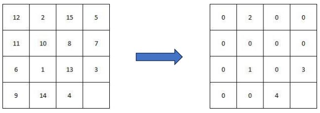

# Reinforcement Learning Agent For 15 Puzzle

Training of a Reinforcement Learning Agent for solving the [Fifteen Puzzle](https://en.wikipedia.org/wiki/15_puzzle) Game

## State space of the problem
Although the Fifteen Puzzle game seems to be not so difficult to solve, its state space is huge. Since each tile can be positioned in every position of the board, there are 16! possible states and for each state, on average, can be performed 3 actions, so the total number of <state, action> pairs is ~ 3 ∗ 16! ≅ 62.768.369.664.000.

It is clear that is not possible to explore and store all the states in the memory of a normal computer. For this reason, it is needed use a heuristic to reduce the state space.

## Reduce the state space dimension

To reduce the number of states, we can think about how the game is usually solved. The puzzle is solved row by row: first the first row, then the second row and then the other remaining two rows.

</img>

Let’s suppose that we have to solve the first column. We are only interested in the positions of the  tiles 1, 2, 3, 4 and the empty tail. We don’t care about the others. So, what we can do to reduce the number of states is “masking” with a 0 all the tiles of which we don’t care the position in the board. By masking these tiles with a 0, we make them equals, so the state change only if the position of one of the non-zero tiles changes. When completing the first row, the possible positions for each non-zero tail are 16. Instead, for the second row, the number of possible positions are 12 
since once the first row is solved, we don’t touch it anymore. For the third and fourth row, the possible positions are 8. In this case we can’t solve first the third and then the fourth row: we must
solve them simultaneously.

By doing this we obtain the following state space dimension:
• First row: We can place the 5 tiles (1, 2, 3, 4, empty_tile) in 16 different positions, so we 
have: 16 ∗ 15 ∗ 14 ∗ 13 ∗ 12 = 524′160 states
• Second row: We can place the 5 tiles (5, 6, 7, 8, empty_tile) in 12 different positions, so we 
have: 12 ∗ 11 ∗ 10 ∗ 9 ∗ 8 = 95′040 states
• Third and Fourth row: Here we must consider all the possible permutations of the 8 tiles, so:
8! = 40′320 states

The total number of states is then 659’520 that is much smaller than the original one.

## Use the trained policy

Since the learned _policy_ file is too heavy, I was obligated to put it in a _.zip_ file. So if you want to use the _policy_ you need to _unzip_ that file.
